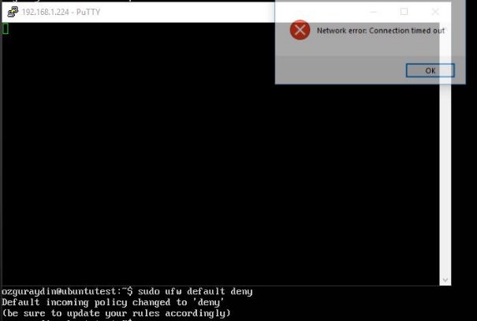

LINUX SUNUCU FIREWALL 

15 ARALIK 2018 SİSTEM DEPARTMANI

**LINUX SUNUCU FIREWALL** 

Her sunucunun içerisinde bir firewall vardır. Linux sunucuda firewall durumunu **sudo ufw !status** komutu ile gerçekleştiririz. Farklı Linux dağıtımlarında komut değişebilir ancak kontrol biçimi aynıdır. 

Firewall’u varsayılan ayarlarla kullanmak için ; **Sudo ufw default allow** (Herşeye izin verir.) 

**Sudo ufw default deny** (Geleni engeller.) 

Firewall’u etkinleştirmek için **sudo ufw enable** 

Firewall’u kapatmak için **sudo ufw disable** 

Firewall’u default olarak allow ayarladıktan sonra istediğimiz portları kapatabiliriz yada tersini yapabiliriz. 80 portunu kapatarak sunucuya http olarak erişilmesini engelleyebiliriz. 

Porta izin vermek için allow kullanılır. Port numarasının sonuna /tcp veya /udp ekleyerek veri gönderme tipini belirleyebilirsiniz. 

Girilen kuralları görmek için **sudo ufw status numbered** komutu kullanılır. 

Girilen kuralı silmek için eğer kural engelleme ise **sudo ufw delete deny portnumarası**, izin verme ise sudo ufw delete allow portnumarası yazılır. 

Belirli bir IP’yi engellemek için ise from sözcüğünü kullanıyoruz. Belirli bir bloğu engellemek için 192.168.1.\* IP adresi yerine yazılır. 

Belirli bir IP’ye izin vermek istiyorsak; 

Sudo ufw allow to 192.168.1.106 (outgoing) Sudo ufw allow from 192.168.1.106 (incoming) To sunucudan hedef IP’ye istekleri engeller. From hedef IP’den sunucuya engeller. 

Belirli bir servis için kural girmek istersek sudo ufw dent telnet (servis ismi) komutunu kullanırız. (insert 1 ile kuralı istediğimiz sıraya yerleştirdik.) 

Belirli bir IP’nin belirli bir portuna izin vermek istiyorsak sudo ufw allow from 192.168.1.106 to any port 22 komutunu kullanırız. Ancak burada status durumuna baktığımızda girdiğimiz kural en aşağıda görünüyor. Üzerinde bu IP için Deny olduğundan girdiğimiz kuralın bir anlamı yok.  

Belirli bir sıraya kural eklemek için; insert’den sonraki sayı kurallın numarasıdır. Burada girdiğimiz kuralı en başa alıyoruz. 

Kuralların sırasını değiştirmek için ilk önce yerini değiştirmek istediğiniz kuralı siliyoruz. Sonrasında hangi sırada olmasını istiyorsak o sıraya insert ediyoruz. 

Ping isteklerini engellemek istersek ping paketlerini sunucu üzerinden düşürmek gerekir. Bunun için /etc/ufw/before.rules dosyasında bulunan kuralları drop olarak değiştirmek gerekir. Burada kilit nokta daha önceden sizin girdiğiniz kurallar var ise bir tane daha before.rules dosyası bulunur. Değişikliği bu dosyada da yapmak gerekir. 

Accept olan kuralları DROP olarak değiştiriyoruz. 

Firewall’u resetlerseniz önceden girdiğiniz tüm kurallar silinecek ve firewall kapatılacaktır. 

5 
